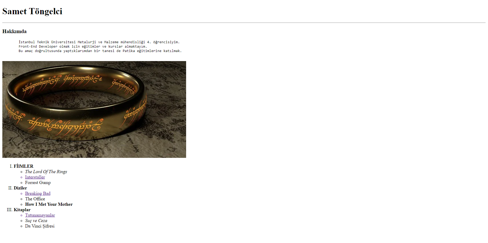

--- 

# ÖDEV 1

### İlk Web Sayfamızı Oluşturmak

**Tasks:**
- Siteyi açtığımızda adınız ve soyadınızı **başlık** şeklinde göstermeniz gerekiyor.
- Ad-Soyadın altında alt başlık olarak **Hakkımda** yazmalıdır.
- Altına paragraf içerisinde neler yaptığınızı ve nelerden hoşlandığınızı yazabilirsiniz.
- Web sitenizi kaydederken dosya adı olarak **'index.html'** seçmeniz gerekmektedir.
- Yazdığınız kodları açıklayan **yorum satırları** eklemeyi unutmayın.

[Ödev - 1 Sayfası](https://app.patika.dev/courses/html/odev1)

---

# ÖDEV 2

#### Kişisel Sayfamızı Detaylandırmaya Devam Etmek

**Tasks:** 
- Sayfanıza bir adet **resim ekleyin** ve bu resime bir **açıklama** yazın.
- Sevdiğiniz film, dizi ve kitapları bunlar başlıklar olacak şekilde sıralayınız. *(Film, dizi, kitap sıralı liste, içerikleri bullet liste olacak şekilde)*
- Bunları sıralarken film ve dizilerin en az bir tanesine **IMDb linki**, kitapların bir tanesine de** Goodreads linkini** yazınız.
- Kurduğunuz yapılarda `block`, `inline` gibi elementler kullanmaya çalışın.

[Ödev - 2 Sayfası](https://app.patika.dev/courses/html/odev2)

---

## Connect with me:

    &nbsp;   

 

