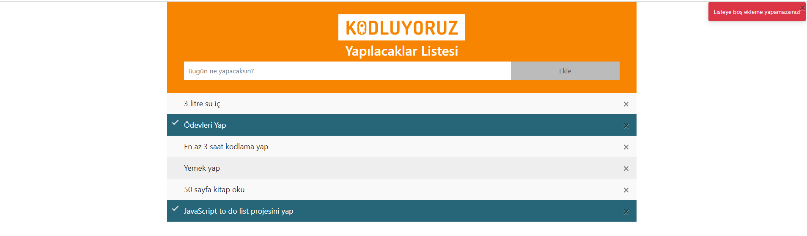

# JavaScript Ödev - 2

## Javascript ile To Do List

[Ödev Linki](https://app.patika.dev/courses/javascript/odev2)

### TAKS

- Listeye boş karakter eklenemiyor. Bununla birlikte hiçbir şey yazılmadığında da aynı hatayı veriyor.

- Yazacağınız JavaScript kodu içerisinde element eklemeyi sağlayan bir fonksiyon, element silmeyi sağlayan bir fonksiyon, yapıldı işaretlenmesini sağlayan bir fonksiyon olması gerekiyor.

- Element eklendiğinde ve hata verirken sağ üstte uyarı verdiğini fark etmişsinizdir. Bunu sağlayan Bootstrap Toast bildirimdir. Sayfaya gidip toast nedir nasıl yapılır bunu araştırın ve kodunuza ekleyin.

- Yaptığınız yapıya Local Storage'ı da ekleyip verilerin kaybolmamasını sağlayın.

## Connect with me:

    &nbsp;   

 

